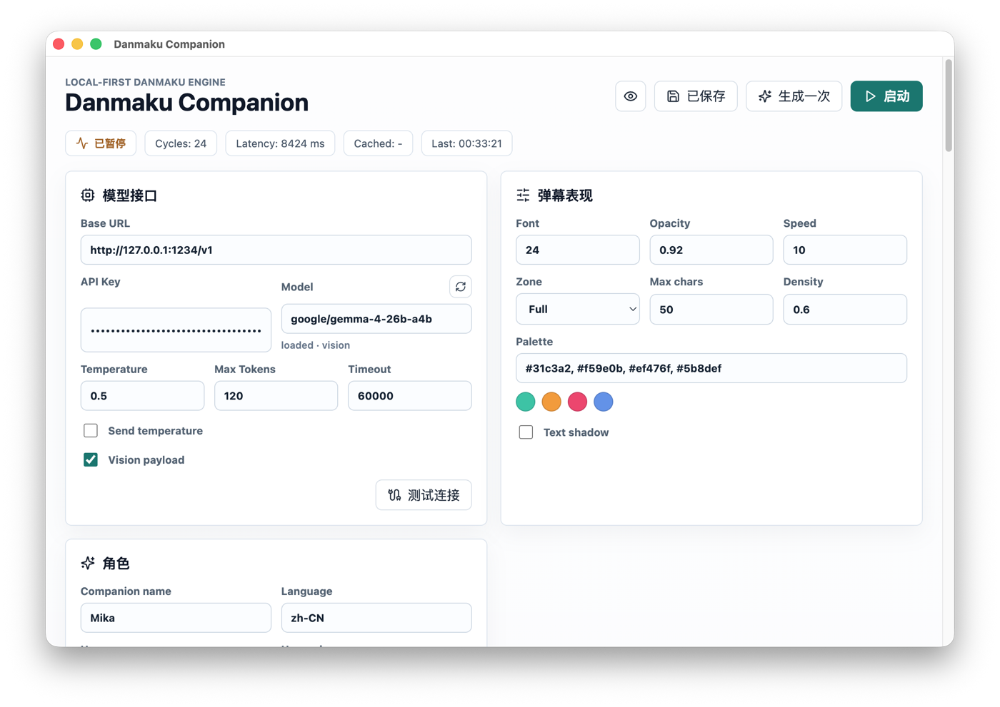

# Danmaku Companion

Danmaku Companion is a local-first desktop overlay that generates short danmaku
comments from a vision-capable, OpenAI-compatible model provider.



## What It Does

- Renders a transparent, click-through danmaku overlay on macOS and Windows.
- Talks to local or hosted OpenAI-compatible endpoints, including LM Studio style
  servers.
- Can send screen captures to vision models when the user enables the vision
  payload.
- Supports randomized generation intervals, randomized release windows, fixed
  comments per cycle, and local generation logs.
- Stores configuration locally and does not include telemetry.

## Privacy Notes

Screenshots are captured only when vision payload is enabled. API keys and
provider settings live in the local app configuration, not in this repository.
The app ignores `.env` files and release artifacts by default.

On macOS, screen capture requires the system Screen Recording permission for the
installed app bundle.

## Development

```bash
npm install
npm run typecheck
npm run dev
```

## Packaging

```bash
npm run package:mac
npm run package:win
```

macOS builds are signed after packaging when a code signing identity is
available. To choose one explicitly, set `DANMAKU_CODESIGN_IDENTITY`.

Windows builds use Electron Builder's NSIS target.

## Status

The app is actively evolving around screen-aware comments, natural release
timing, and local model workflows.
